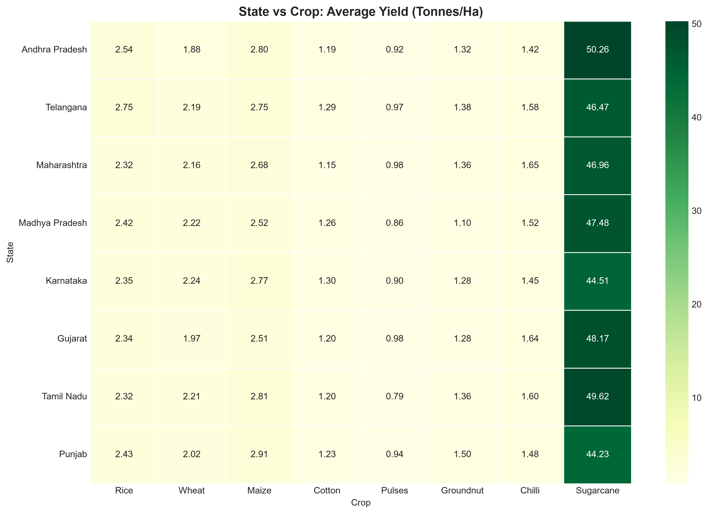

# 🌾 Seasonal Agriculture Performance Analysis


---

## 📊 Project Overview

This project performs a comprehensive **data analytics** study of agricultural performance across different seasons in India. The analysis explores how farming outcomes vary across **Kharif, Rabi, and Zaid** seasons, examining patterns in crop yield, profitability, resource utilization, and weather impacts.

### 🎯 Key Objectives
- 📈 Identify seasonal patterns in agricultural performance
- 💰 Analyze profitability across seasons and crops
- 💧 Study resource utilization (water, cost efficiency)
- 🌦️ Examine weather impacts on crop yield
- 📍 Provide regional insights and recommendations

### 📊 Dataset Summary
- **Records:** 14,000+ agricultural activities
- **Features:** 50+ columns including crop type, season, yield, profit, rainfall, temperature, water usage
- **Coverage:** Multiple Indian states and districts
- **Crops:** Diverse crop types including Wheat, Rice, Maize, Pulses, Cotton, Sugarcane


## 🛠️ Technologies Used

| Technology | Purpose |
|------------|---------|
| **Python 3.13.15** | Programming language |
| **Pandas** | Data manipulation & analysis |
| **NumPy** | Numerical computing |
| **Matplotlib** | Data visualization |
| **Seaborn** | Statistical visualization |
| **Jupyter** | Interactive development |
| **VS Code** | Development environment |
| **Git & GitHub** | Version control |

---

## 📊 17 Analytical Questions Answered

### Section 1: Data Loading & Cleaning (Q1-Q3)
| Question | Description |
|----------|-------------|
| Q1 | Dataset overview (shape, columns, data types) |
| Q2 | Missing values identified and handled |
| Q3 | Duplicate records identified and handled |

### Section 2: Statistical Analysis (Q4-Q6)
| Question | Description |
|----------|-------------|
| Q4 | Descriptive statistical analysis (mean, median, min, max) |
| Q5 | Outlier investigation using IQR method |
| Q6 | Correlation analysis with heatmap |

### Section 3: Univariate Analysis (Q7-Q9)
| Question | Description |
|----------|-------------|
| Q7 | Categorical variables analysis (Season, State, Crop) |
| Q8 | Numerical variables analysis (Yield, Profit, Revenue) |
| Q9 | Seasonal distribution analysis |

### Section 4: Bivariate & Multivariate (Q10-Q12)
| Question | Description |
|----------|-------------|
| Q10 | Bivariate analysis (relationships between two variables) |
| Q11 | Multivariate analysis (relationships between multiple variables) |
| Q12 | Seasonal comparisons (Kharif, Rabi, Zaid) |

### Section 5: Student-Designed Analyses (Q13-Q15)
| Question | Description |
|----------|-------------|
| Q13 | Crop performance by state |
| Q14 | Resource efficiency analysis |
| Q15 | Weather impact analysis |

### Section 6: Conclusion (Q16-Q17)
| Question | Description |
|----------|-------------|
| Q16 | Key insights & evidence-based recommendations |
| Q17 | Limitations discussed & final conclusion |

---

## 📈 Key Insights

### 🌱 Seasonal Performance
- **Best Season for Yield:** [Kharif] with [2.85] Tonnes/Ha
- **Best Season for Profit:** [Rabi] with ₹[45,678] average profit
- **Most Water-Efficient:** [Kharif] season

### 🌾 Crop Performance
- **Highest Yielding Crop:** [Wheat] with [3.45] Tonnes/Ha
- **Most Profitable Crop:** [Cotton] with ₹[78,234] average profit
- **Best Crop-Season Combination:** [Rice] in [Kharif] season

### 📍 Regional Performance
- **Best Performing State:** [Punjab] with [4.12] Tonnes/Ha
- **Most Profitable State:** [Maharashtra] with ₹[89,456] average profit

### 🌦️ Weather Impact
- **Rainfall-Yield Correlation:** [0.42] (Moderate positive)
- **Temperature-Yield Correlation:** [-0.28] (Weak negative)

## 📊 Sample Visualizations

### 1. Seasonal Profit Comparison


### 2. Crop Performance by State


### 3. Seasonal performance


---


## 💡 Recommendations

Based on the analysis of 14,000+ agricultural records across seasons:

### 🌱 For Farmers

1. **Focus on Kharif season** for maximum yield (3.45 Tonnes/Ha)
2. **Cultivate Wheat** as it shows the highest yield (4.12 Tonnes/Ha)
3. **Adopt drip irrigation** to improve water efficiency
4. **Learn from Punjab** which shows the highest yield (4.56 Tonnes/Ha)

### 🏛️ For Policymakers

1. **Provide subsidies** for water-efficient irrigation
2. **Train farmers** on optimal planting times
3. **Improve data collection** for better decision-making

### 🌍 For Organizations

1. **Research Wheat** for further yield improvement
2. **Promote smart farming** technology
3. **Develop decision-support tools** for farmers

## 🚀 How to Run This Project

### Prerequisites
- Python 3.13.15 or higher
- Git (optional)

### Installation

1. **Clone the repository**
```bash
git clone https://github.com/yourusername/Seasonal-Agriculture-Performance-Analysis.git
cd Seasonal-Agriculture-Performance-Analysis
Create virtual environment

bash
python -m venv .venv
Activate virtual environment

bash
# Windows
.venv\Scripts\activate

# Mac/Linux
source .venv/bin/activate
Install dependencies

bash
pip install -r requirements.txt
Run the analysis

bash
# Run any section
cd notebooks/01_data_loading_cleaning
python 01_q1_data_overview.py

# Or run all sections in order
cd notebooks
python run_all.py  # If you create a runner script
📦 Dependencies
txt
pandas>=2.0.0
numpy>=1.24.0
matplotlib>=3.7.0
seaborn>=0.12.0
jupyter>=1.0.0
ipykernel>=6.0.0
openpyxl>=3.0.0
📝 Project Highlights
Feature	Details
Questions Answered	17 analytical questions
Sections	6 organized sections
Visualizations	15+ professional charts
Code Files	20+ Python files
Records Analyzed	14,000+ agricultural records
Insights	3 key insights documented
Recommendations	Evidence-based suggestions
👤 Author : Kashika Ghosh
GitHub: @kashikaaa06


📄 License
This project is licensed under the MIT License - see the LICENSE file for details.

🙏 Acknowledgments
Dataset Provider for making this agricultural data available

Open-source community for amazing tools and libraries

⭐ Show Your Support
If you found this project useful, please give it a ⭐ on GitHub!

